<div align="center">

# MediQueue

**A hospital OPD queue, appointment, and token management system**

[](https://nodejs.org/)
[](https://expressjs.com/)
[](https://www.mysql.com/)
[](https://sequelize.org/)
[](#license)

[Live Demo](https://mediqueue-le7k.onrender.com) &nbsp;•&nbsp; [Features](#features) &nbsp;•&nbsp; [Screenshots](#screenshots) &nbsp;•&nbsp; [Setup](#getting-started)

</div>

---

## Overview

Outpatient departments in most hospitals still run on physical tokens and manual queue management — patients wait without knowing how long is left, and staff have no digital record of a visit until it's written on paper.

MediQueue digitizes that entire flow. A patient books an appointment for a department and date, receives a QR-coded token, and can track their position in the queue in real time. At the hospital, staff scan the token at entry, doctors pull up the patient's history and record the visit digitally, and prescriptions are routed straight to the pharmacy counter.

This was built as a full-stack academic project to explore real-world hospital workflow design, covering authentication, role-based access, relational data modeling, and real-time-style status updates — end to end, from database to deployed application.

## Features

- **Authentication** — Email/password and Google Sign-In, with JWT-secured API routes and role-based access (Patient, Doctor, Pharmacy Staff, Admin)
- **Appointment Booking** — Book by department and date, with per-doctor daily token limits and availability checks
- **QR Token System** — Each booking generates a unique, date-scoped QR token used for entry verification
- **Live Queue Display** — Real-time "now serving" screen per department, auto-refreshing
- **Doctor Panel** — Scan a patient's token, view their visit history, and record diagnosis and prescription
- **Digital OPD Card** — A persistent medical record per patient, carried across every visit
- **Pharmacy Module** — Track medicine stock and move prescriptions through pending → preparing → ready states
- **Admin Panel** — Manage doctors, staff accounts, department settings, and daily token limits

## Screenshots

<table>
<tr>
<td width="33%">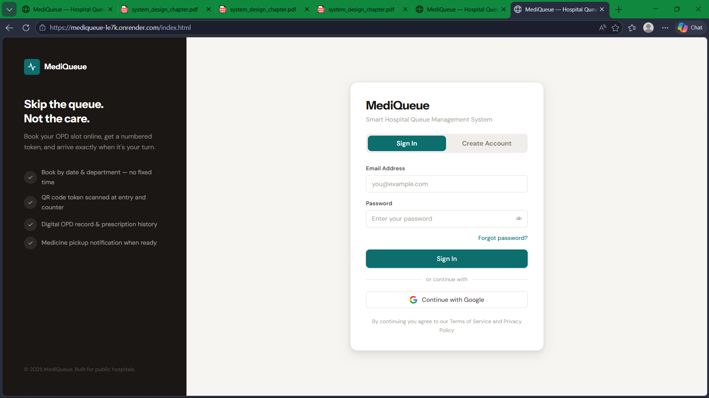<br/><sub>Login / Sign up</sub></td>
<td width="33%">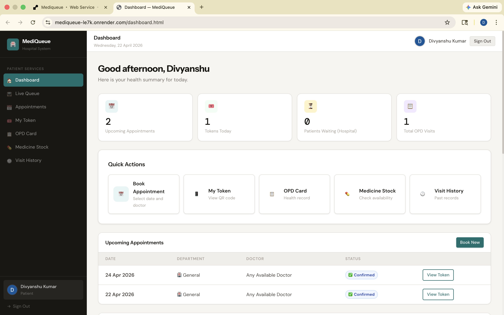<br/><sub>Patient dashboard</sub></td>
<td width="33%">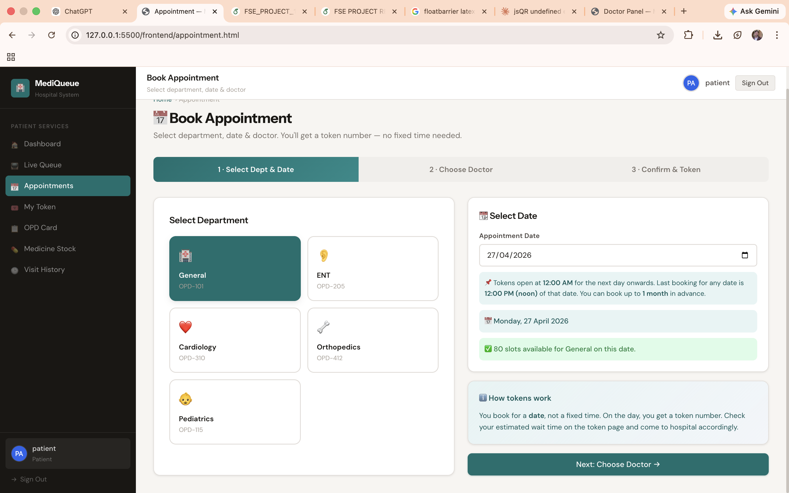<br/><sub>Book appointment — select department & date</sub></td>
</tr>
<tr>
<td width="33%">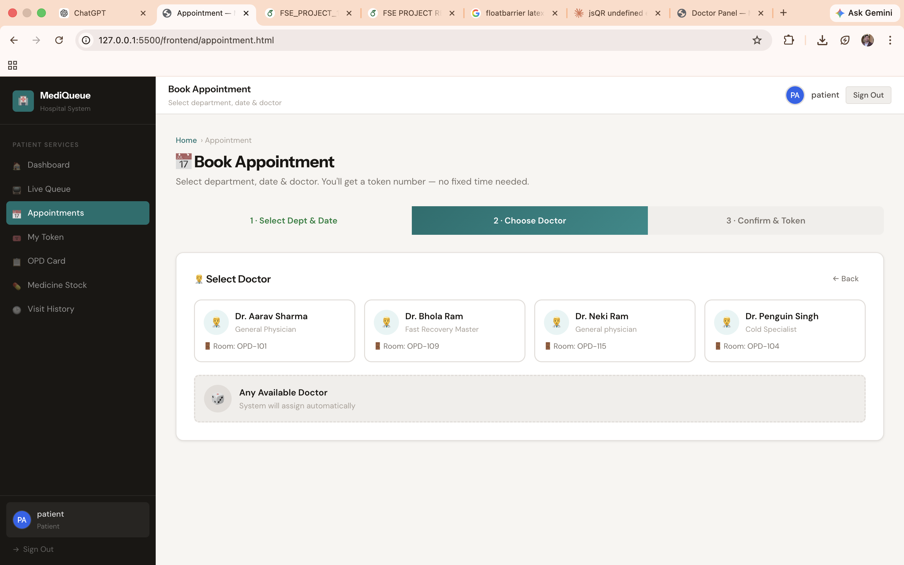<br/><sub>Book appointment — choose doctor</sub></td>
<td width="33%">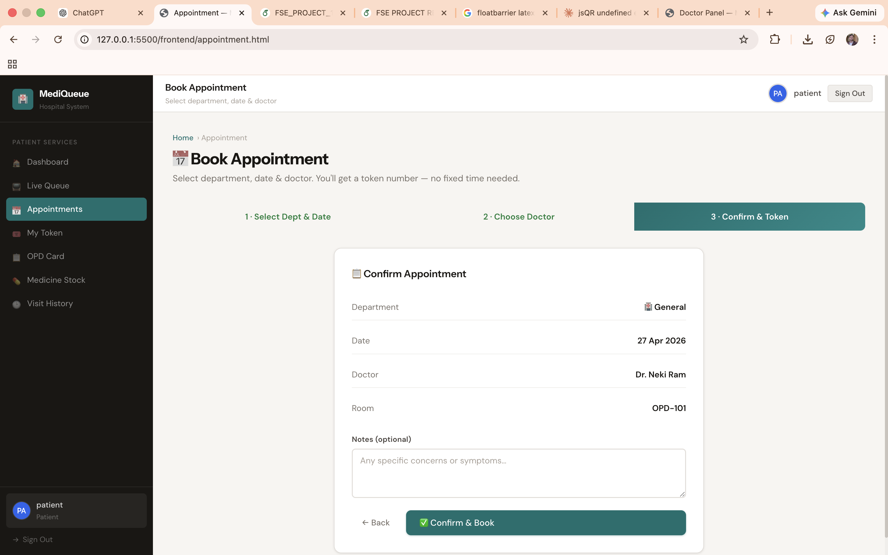<br/><sub>Book appointment — confirm & get token</sub></td>
<td width="33%">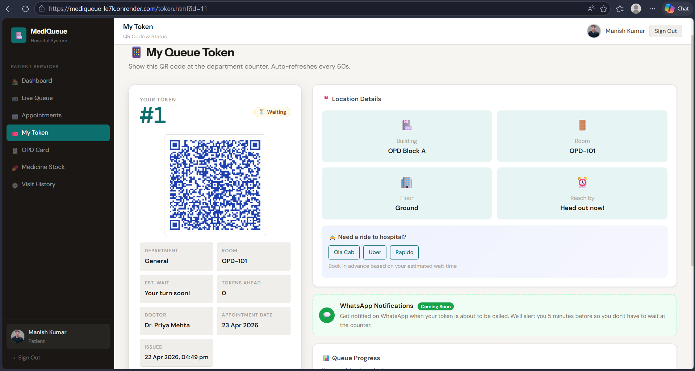<br/><sub>QR token with live queue status</sub></td>
</tr>
<tr>
<td width="33%">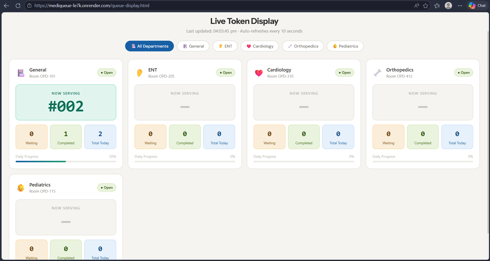<br/><sub>Live "now serving" queue display</sub></td>
<td width="33%">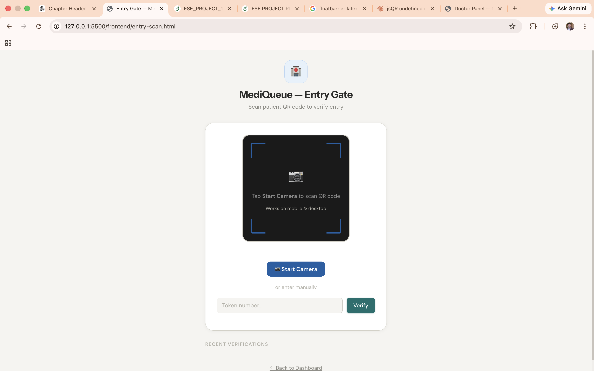<br/><sub>Entry gate — QR verification</sub></td>
<td width="33%">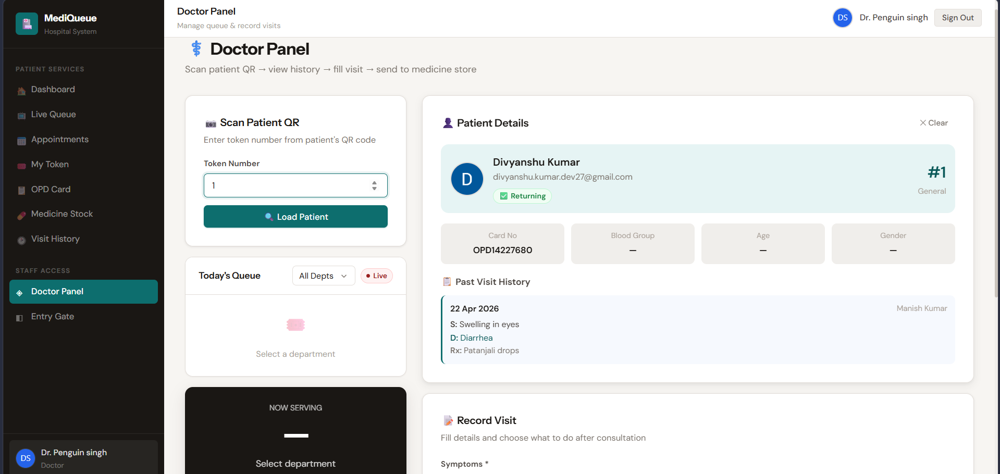<br/><sub>Doctor panel — patient history & visit entry</sub></td>
</tr>
<tr>
<td width="33%">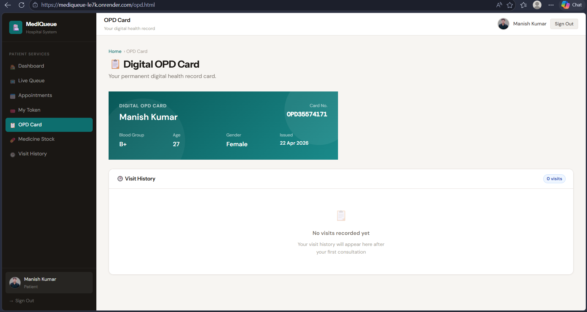<br/><sub>Digital OPD card</sub></td>
<td width="33%">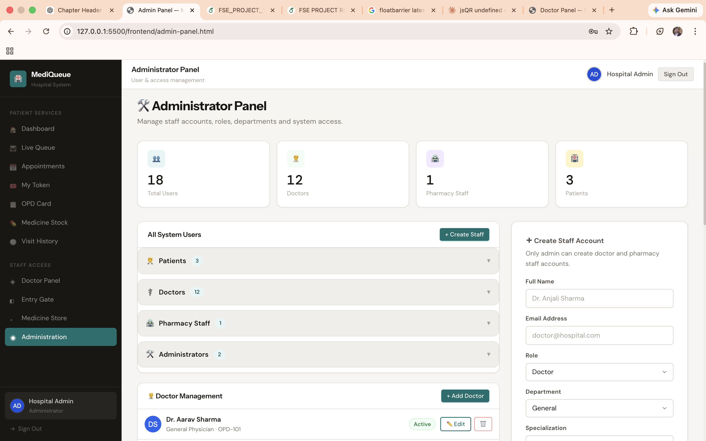<br/><sub>Admin panel — staff & access management</sub></td>
<td width="33%">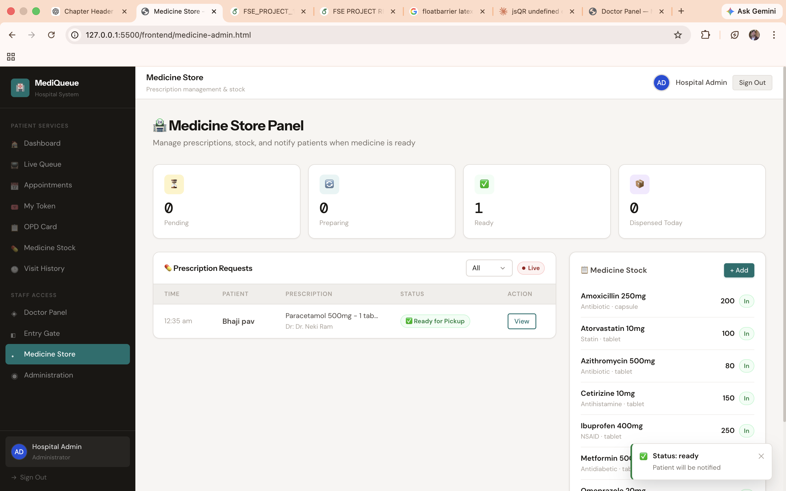<br/><sub>Pharmacy — prescription queue & stock</sub></td>
</tr>
</table>

## Tech Stack

| Layer | Technology |
|---|---|
| Backend | Node.js, Express 5 |
| Database | MySQL, Sequelize ORM |
| Authentication | JWT (custom) + Firebase Auth (Google Sign-In) |
| Security | bcryptjs password hashing, UUID + QR code generation for tokens |
| Frontend | HTML5, CSS3, vanilla JavaScript |
| Hosting | Render (backend), Aiven (managed MySQL) |

## Project Structure

```
MediQueue/
├── backend/
│   ├── server.js                 Entry point — starts the server, seeds default admin
│   ├── .env.example              Environment variable template (no real secrets)
│   ├── config/db.js              Sequelize MySQL connection
│   ├── models/                   User, Doctor, Appointment, Token, OPDCard, Medicine, etc.
│   ├── controllers/              Route logic — auth, appointments, tokens, OPD, medicines
│   ├── routes/                   Express route definitions
│   ├── seed-doctors.js           Utility script — populate sample doctors
│   └── reset-admin-password.js   Utility script — reset/create the admin account
├── frontend/
│   ├── index.html                Login / registration
│   ├── appointment.html          Book appointment
│   ├── token.html                 Token & QR display
│   ├── queue-display.html        Live queue screen
│   ├── entry-scan.html           Token scanner (entry desk)
│   ├── doctor-panel.html         Doctor's scan + visit interface
│   ├── admin-panel.html          Admin console
│   ├── dashboard.html            Patient dashboard
│   ├── medicines.html / medicine-admin.html   Pharmacy module
│   └── opd.html / history.html
├── mysql_setup.sql               Reference script for local DB + user creation
└── .gitignore
```

## Getting Started

### Prerequisites
- Node.js v18 or later
- A MySQL instance (local or managed — e.g. Aiven, PlanetScale, Railway)

### 1. Clone the repository
```bash
git clone https://github.com/Divyanshukumar2005/MediQueue-Hospital-Management-System.git
cd MediQueue-Hospital-Management-System
```

### 2. Set up the database
```bash
mysql -u root -p < mysql_setup.sql
```

### 3. Configure environment variables
```bash
cd backend
cp .env.example .env
```
Fill in your MySQL credentials and a secure `JWT_SECRET` in `.env`.

### 4. Install dependencies and run
```bash
npm install
npm start
```

### 5. Open the frontend
Open `frontend/index.html` in a browser, or serve the `frontend/` folder with any static server.

## Deployment

**Backend** is deployed on [Render](https://render.com) as a Node.js Web Service:
- Root directory: `backend`
- Build command: `npm install`
- Start command: `npm start`
- All variables from `.env.example` are set as Environment Variables in the Render dashboard — never uploaded as a file
- Database: managed MySQL on [Aiven](https://aiven.io)

**Frontend** is served as static files and can be deployed on any static host (Netlify, Vercel, GitHub Pages). The backend API URL is configured in `frontend/script.js`:
```js
const API = 'https://mediqueue-le7k.onrender.com/api';
```
Update this if you deploy your own backend instance.

> Free-tier hosting spins down after inactivity — the first request after idle time may take 30–60 seconds while the server wakes up.

## Environment Variables

| Variable | Description |
|---|---|
| `PORT` | Port the backend server runs on |
| `DB_HOST`, `DB_PORT`, `DB_NAME`, `DB_USER`, `DB_PASS` | MySQL connection details |
| `DB_SSL` | Set to `true` for hosts that require SSL (e.g. Aiven) |
| `JWT_SECRET` | Required. A long random string used to sign auth tokens — the server refuses to start without it |
| `DEFAULT_ADMIN_EMAIL` | Optional — email for the auto-created admin account |
| `DEFAULT_ADMIN_PASSWORD` | Optional — if unset, a random password is generated and printed once on first run |

## Utility Scripts

Two standalone scripts in `backend/` for one-off database setup, meant to be run locally:

| Script | Purpose |
|---|---|
| `seed-doctors.js` | Populates the `doctors` table with sample doctors across all departments |
| `reset-admin-password.js` | Creates the admin account if missing, or resets its password |

```bash
cd backend
node seed-doctors.js
node reset-admin-password.js
```

Both scripts read connection details from environment variables (or a placeholder in the file, which should never be committed with a real value filled in).

## Security Notes

- No real credentials or `.env` files are committed to this repository
- The default admin account uses a randomly generated password on first run, printed once to the host's console logs — not a fixed default
- The server refuses to start if `JWT_SECRET` is missing, rather than falling back to an insecure default
- The Firebase config in the frontend uses a public Web API key, which is standard for Firebase client SDKs — access is controlled through Firebase Authentication rules, and the key should be restricted to the deployed domain in the Google Cloud Console for production use


## Author

**Divyanshu Kumar**
B.Tech, Electronics & Communication Engineering — University of Delhi

[Portfolio](https://gignova.netlify.app) · [LinkedIn](https://www.linkedin.com/in/divyanshu-kumar-7625a8315) · [GitHub](https://github.com/Divyanshukumar2005)
